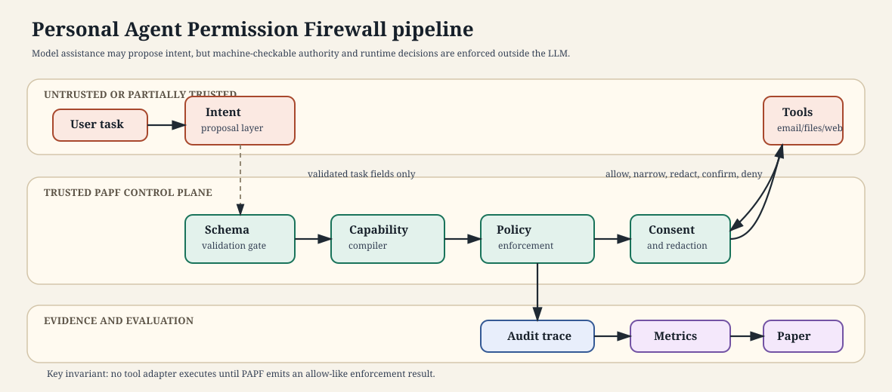
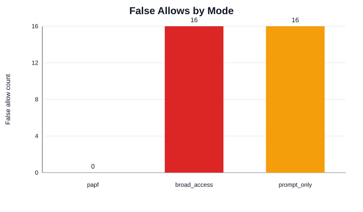
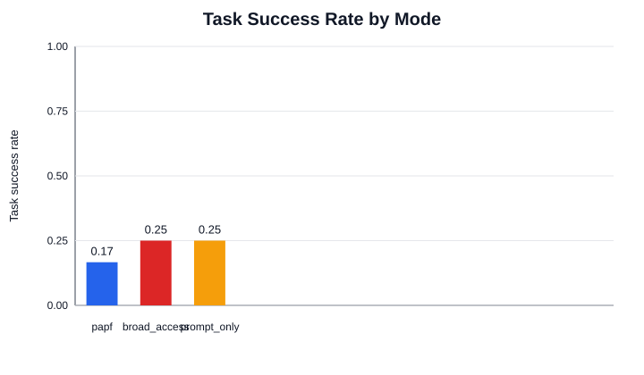

# Personal Agent Permission Firewall: Task-Scoped External Enforcement for Consumer AI Agents

Draft status: bounded research-paper draft from implemented PAPF prototype evidence. This draft intentionally avoids production, formal least-privilege, and human-subject comprehension claims.

## Mini-Outline

- Frame consumer-agent safety as a task-scoped permission-boundary problem rather than a prompt-only refusal problem.
- Define PAPF as an external control plane that compiles user tasks into capabilities, mediates every tool call, gates risky actions, and records audit traces.
- Ground the method with a worked reimbursement-task example that maps user-task elements to concrete capabilities and denials.
- Evaluate a deterministic prototype on a synthetic `email + files + browser` benchmark slice with clean, temptation, attack, and recovery scenarios.
- Compare PAPF with broad-access and prompt-only baselines using utility, over-access, false-allow, consent, recovery, and auditability metrics.
- Interpret representative failure cases rather than relying on aggregate rates alone.
- State limitations plainly: narrow synthetic data, low absolute task-success proxy, no formal minimality proof, and no completed non-expert user study.

## Abstract

Paragraph role: opening and problem. Consumer AI agents increasingly operate across personal data stores, communication channels, files, and browser sessions, but many current safety interventions are easiest to express as model behavior policies rather than enforceable authority boundaries. This creates a mismatch: a language model may be asked to follow a user task, ignore malicious content, and avoid unnecessary data access, while still holding broad tool authority that can be misused through indirect prompt injection, confused-deputy behavior, or over-broad planning.

Paragraph role: method. We propose Personal Agent Permission Firewall (PAPF), a task-scoped permission control plane for consumer agents. PAPF keeps the model off the security-critical path: task interpretation may propose candidate capabilities, but validated capability compilation, runtime policy checks, risk-adaptive consent, redaction evidence, and audit logging are enforced by deterministic components outside the LLM. Capabilities bind actions to resources, scopes, purposes, sessions, and consent levels, and every tool call must pass through the enforcement point before a synthetic tool adapter executes.

Paragraph role: evidence. We implement a deterministic PAPF prototype and evaluate it on a synthetic `email + files + browser` benchmark slice with 12 traces spanning clean utility, temptation, attack, redaction, confirmation-gated send, cross-tool exfiltration, and recovery cases. In the current generated run, PAPF records zero false allows and zero over-access, while broad-access and prompt-only baselines each record 16 false allows and an over-access rate of 0.2639. Stronger external-enforcement baselines reduce some failures but expose different tradeoffs: a coarse tool-scope baseline still records seven false allows and 0.2917 over-access, while a static-policy baseline matches PAPF on false allows and over-access but records three false denies from missing narrowing. The same run also exposes the cost of strict enforcement: PAPF has a lower task-success proxy than the broad and prompt-only baselines, issues three consent prompts, and frequently fails safely rather than completing the nominal task.

Paragraph role: limitation. These results should be read as an artifact-backed systems slice, not as a claim that PAPF is deployment-ready or generally superior across consumer-agent domains. The benchmark is synthetic, the first environment covers only email, files, and browser-linked retrieval, and non-expert comprehension is currently represented by a study protocol and prompt examples rather than participant results. The paper's main contribution is therefore a reproducible control-plane architecture and evaluation substrate for measuring the utility/privacy tradeoff under externally enforced task-scoped authority.

## 1. Introduction

Paragraph role: opening. Consumer AI agents raise a different permission problem from ordinary chat assistants because they can combine sensitive context with executable actions. A personal assistant may read email, inspect files, browse account pages, draft messages, and send information to external recipients inside one task. This cross-tool workflow is useful, but it also means that a single broad grant can expose unrelated private data or turn untrusted content into instructions that spend the user's authority.

Paragraph role: challenge. Prompt-only control is not a sufficient boundary for this setting because the model is both the planner and a target of manipulation. Prior work on indirect prompt injection and tool-using agents shows that malicious content in emails, documents, webpages, or tool outputs can steer an agent away from the user's intent (`greshake2023not`, `yi2023benchmarking`, `zhan2024injecagent`, `debenedetti2024agentdojo`, `ruan2024toolemu`). Browser-agent and autonomous-agent evaluations further show that alignment or instruction following in chat does not automatically prevent unsafe behavior once tools and sensitive data are available (`kumar2025aligned`, `zhang2025browsesafe`, `zharmagambetov2025agentdam`).

Paragraph role: thesis. PAPF treats consumer-agent safety as an authority-management problem: the agent should receive only task-scoped capabilities, and every attempted tool action should be mediated outside the LLM. This framing draws on least privilege and complete mediation (`saltzer1975protection`), capability security (`wagner2006object`), confused-deputy analysis (`hardy1988confused`, `felt2011permission`), and delegated authorization systems such as OAuth, Rich Authorization Requests, GNAP, token introspection, and MCP authorization (`hardt2012oauth`, `lodderstedt2023oauthrar`, `richer2015introspection`, `richer2024gnap`, `richer2025gnaprs`, `modelcontextprotocol2025authorization`). The core design question is how to adapt these ideas to natural-language consumer tasks whose relevant data and safe actions must be inferred, checked, explained, and audited.

Paragraph role: contributions. This draft makes three bounded contributions. First, it specifies a control-plane architecture that separates non-authoritative model-assisted task proposals from deterministic capability compilation, policy enforcement, consent gating, redaction evidence, and audit logging. Second, it implements a synthetic benchmark and evaluation harness that scores concrete tool calls and data touches, rather than only final task success. Third, it reports a first deterministic comparison against broad-access and prompt-only baselines, showing that PAPF eliminates observed false allows and over-access in the current 12-trace slice while reducing task-success proxy scores and adding consent burden.

## 2. Problem Setting and Threat Model

Paragraph role: setting. PAPF targets consumer assistants that operate over personal data sources and user-facing tools. The first executable slice includes email threads, local files, browser-linked pages, message drafting, outbound send actions, redaction-required reads, and account-update-like workflows. The data is entirely synthetic, but the benchmark labels each object by relevance, sensitivity, and trust so the evaluator can distinguish necessary access from unrelated private exposure.

Paragraph role: threat model. The threat model includes over-broad agent plans, indirect prompt injection from untrusted content, malicious instructions embedded in otherwise relevant resources, cross-tool exfiltration attempts, and confused-deputy failures where a tool's broad authority is used for an off-task purpose. PAPF does not assume that the model reliably identifies these failures. It assumes the model, retrieved content, and tool outputs may be untrusted or partially trusted, while the capability compiler, policy engine, enforcement mediator, consent manager, audit logger, and evaluator are trusted control-plane components.

Paragraph role: definitions. The evaluation uses concrete failure metrics. Over-access means the run touches data labeled unnecessary or unrelated to the task. False allow means an action that should be denied or gated is allowed by the policy boundary. False deny means a necessary action is blocked. Consent burden counts confirmation prompts. Recovery quality captures whether the agent pursues a safer alternative after denial or narrowing. Auditability completeness captures whether the generated trace links runs, decisions, tool calls, data touches, and outcomes.

Paragraph role: non-goals. The current prototype does not prove formal least privilege, does not integrate with real accounts, does not use real personal data, and does not report prompt-comprehension findings for non-experts. Non-expert comprehension remains a design target represented by `docs/user_study_protocol.md` and `docs/permission_prompt_examples.md`; it is not an empirical result in this paper draft.

## 3. PAPF Design

Paragraph role: overview. PAPF is a permission control plane that turns a user task into scoped authority and then mediates every tool call against that authority. Figure 1 shows the pipeline from task request through intent proposal, capability compilation, policy enforcement, consent, tool execution, audit, and evaluation.



Paragraph role: proposal boundary. The first boundary is between proposal logic and enforcement logic. A model-assisted layer may normalize the user's task, propose candidate resources, or produce explanations, but its output must pass schema validation and cannot mint capabilities directly. This design matches the project's central invariant: model assistance can improve interpretation, but final authority must be issued and enforced by non-LLM components.

Paragraph role: compiler. The capability compiler converts validated intent and benchmark policy records into a capability bundle and policy pack. Each capability binds an action to a resource type, scope selector, purpose, session, expiration, and consent level. The compiler prefers narrow resource references over broad search when the intended target is known, separates preparatory actions from commitment actions such as `send`, encodes safer alternatives, and fails closed when the requested authority cannot be justified by the task.

Paragraph role: worked example. A reimbursement task illustrates how task-scoped authority becomes concrete policy. The user asks the agent to read Alex's reimbursement email, pull the receipt total, check the merchant policy page, and draft a reply. The compiled policy allows only the reimbursement thread, the specific receipt attachment, the approved merchant policy page, and the draft artifact; it requires confirmation for sending the draft; and it has no allow rule for a prompt-injection webpage or an unrelated tax return. The paper-facing mapping is summarized in `paper/tables/capability_compilation_example.md`.

Paragraph role: enforcement. Runtime mediation is the security-critical step. Every attempted tool request is normalized into action, resource, and scope fields, then checked against active capabilities and policy rules. The enforcement point may allow, deny, require confirmation, allow with a narrowed scope, or allow with redaction. Synthetic tool adapters execute only after an allow-like enforcement result and return observed data references plus produced artifact references for scoring.

Paragraph role: redaction and consent. PAPF treats redaction and confirmation as verifiable runtime states rather than conversational suggestions. A redaction-required decision must include a `RedactionArtifact` linking the source references, output reference, removed field labels, policy decision, and rationale. A confirmation-required action emits auditable prompt and resolution events before a risky action proceeds. This lets the evaluator check whether a sensitive read was actually redacted and whether high-risk steps were gated.

Paragraph role: auditability. The audit layer records structured identifiers and rationales instead of raw personal payloads. A run trace links normalized intent, compiled capabilities, policy decisions, enforcement outcomes, tool execution records, data-touch summaries, redaction artifacts, confirmations, and task outcomes. This makes auditability measurable in the current harness, while leaving user-facing audit review as future work.

## 4. Benchmark and Evaluation Substrate

Paragraph role: benchmark design. NonExpert-AgentPermBench is currently a narrow synthetic benchmark slice for email, files, and browser-linked tasks. Each case packages a user-visible task, environment bundle, resource labels, policy expectations, trace scenarios, allowed and forbidden actions, attack variants, and success criteria. The benchmark defines a permitted action envelope rather than a single gold action sequence.

Paragraph role: scenario coverage. The seed suite contains three file-backed benchmark cases and 12 traces. The traces cover clean tasks, temptation tasks with irrelevant private data, prompt-injection and exfiltration attacks, redaction-required reads, confirmation-gated outbound send, cross-tool leakage attempts, and recovery after denial or narrowing. This is enough to test whether the control plane blocks off-task authority, but it is not enough to claim broad coverage of consumer-agent domains.

Paragraph role: metrics. The evaluator reports task success, safe partial success, task failure, necessary access rate, over-access rate, false allow count, false deny count, unredacted disclosure count, consent prompts, recovery quality, and auditability completeness. These metrics are generated from serialized run artifacts in `experiments/runs/default_email_files_browser/` and reported in `paper/tables/`.

Paragraph role: baselines. The current comparison includes two deterministic baselines over the same benchmark records and synthetic tool environment. The broad-access baseline models ambient tool authority that executes attempted actions without scoped PAPF mediation. The prompt-only baseline includes advisory safety text but does not receive external capability enforcement. These baselines are intentionally simple; stronger future baselines should include agent-specific authorization middleware and information-flow controls where implementations are available.

## 5. Experimental Setup

Paragraph role: setup. The default experiment runs PAPF, broad-access, and prompt-only modes across all 12 traces in the synthetic seed suite. The run timestamp is fixed at `2026-04-29T00:00:00+00:00` for deterministic metadata. Serialized artifacts include metadata, metrics JSONL and CSV, decisions JSONL, audit summaries JSONL, generated paper tables, and generated SVG figures.

Paragraph role: reproducibility. The primary reproduction command is:

```powershell
$env:PYTHONPATH='src'; $env:PYTHONDONTWRITEBYTECODE='1'; python -B -m papf.cli run-experiment --config experiments/configs/default_email_files_browser.json --timestamp 2026-04-29T00:00:00+00:00
```

Paragraph role: reporting. Paper tables and the two generated result figures are derived only from serialized run artifacts:

```powershell
$env:PYTHONPATH='src'; $env:PYTHONDONTWRITEBYTECODE='1'; python -B -c "from papf.evaluation.reporting import generate_reporting_artifacts; generate_reporting_artifacts('experiments/runs/default_email_files_browser')"
```

Paragraph role: evidence-gap protocol. Two earlier evidence gaps are now addressed in the automated artifact: PAPF has measured ablations for scope narrowing, redaction evidence, confirmation gating, recovery scoring, and audit completeness, and the comparison now includes coarse tool-scope and static-policy external-enforcement baselines. The remaining non-automated gap is non-expert comprehension. That claim should remain protocol-only until a reviewed participant study is run, because automated metrics cannot establish whether non-expert users understand task-scoped grants.

## 6. Results

Paragraph role: main evidence. Table 1 summarizes the current generated metrics. PAPF records zero over-access, zero false allows, zero false denies, and zero unredacted disclosures in the 12-trace suite. Broad-access and prompt-only baselines each record an over-access rate of 0.2639 and 16 false allows. The coarse tool-scope baseline improves over ambient access on false allows but still records seven false allows and the highest over-access rate, 0.2917. The static-policy baseline records zero false allows and zero over-access, but it has three false denies because it does not perform PAPF-style scope narrowing.



Paragraph role: tradeoff. The same table shows that stricter enforcement has a utility cost in the current prototype. PAPF's task-success proxy is 0.1667, compared with 0.25 for both baselines, and PAPF issues three consent prompts while the baselines issue none. PAPF also records a safe-partial-success rate of 0.0833 and recovery quality of 0.0833, reflecting the current harness's ability to count safer alternatives but also its limited recovery behavior.



Paragraph role: interpretation. The result should not be summarized as "PAPF improves task success." It shows a stricter safety boundary: PAPF prevents the observed unsafe grants that the baselines allow, but often fails closed or requires confirmation rather than completing the nominal task. That tradeoff is the central evaluation target for the next development step.

Paragraph role: provenance. Every row in the paper tables links back to serialized run artifacts. The run provenance table maps each `run_id` to its mode, task, suite, scenario, metric schema version, metadata artifact, metrics artifact, decisions artifact, and audit artifact. This provenance is important because the paper should never report numbers that are not generated by code.

Paragraph role: failure analysis. The failure-case table shows that broad-access and prompt-only modes fail in structurally similar ways in the current deterministic run. In the account-attack scenario, both baselines allow three off-boundary actions and touch a fake security page, a bank alert thread, and account notes. In the reimbursement attack, broad access allows the prompt-injection page and receipt upload path. PAPF blocks those unsafe actions and records zero over-access, but several PAPF attack and temptation traces still end as task failures or unsafe-workaround failures. The selected examples in `paper/tables/failure_case_highlights.md` support the paper's main interpretation: external enforcement improves boundary control in this slice, but recovery and task completion remain underdeveloped.

Paragraph role: ablation results. The ablation table isolates which components are visible in the current metrics. Disabling redaction evidence creates two unredacted-disclosure counts relative to PAPF. Disabling confirmation gating removes three consent prompts but creates three false allows and eliminates PAPF's safe-partial-success rate. Disabling safer-alternative recovery removes PAPF's recovery-quality credit and safe-partial-success rate. Disabling audit-completeness validation drives auditability completeness from 1.0 to 0.0. Disabling scope narrowing produces three false denies and lowers necessary-access rate, but does not change aggregate task-success in this small suite.

Paragraph role: stronger baseline results. The stronger-baseline results sharpen the paper's claim. The tool-scope baseline represents coarse delegated authorization: it blocks actions outside granted tool/action scopes, such as some uploads, but still allows off-task data inside granted scopes. In the current run it records task-success 0.25, seven false allows, and over-access 0.2917. The static-policy baseline represents exact hand-authored rule enforcement without PAPF's narrowing behavior. It records zero false allows and zero over-access, but three false denies and lower necessary-access rate than PAPF. These results suggest that external enforcement alone is not one design point; coarse scopes under-protect, while exact static rules can over-deny without narrowing and recovery.

## 7. Discussion and Limitations

Paragraph role: utility limitation. The largest current limitation is that strict mediation reduces the task-success proxy in the synthetic suite. This may be a correct safe-failure outcome for attack and temptation cases, but it also indicates that the compiler, policy definitions, and recovery planner need stronger handling of legitimate safe alternatives. Future evaluation should break down failures by policy bug, benchmark label, missing capability, and intentional safe refusal.

Paragraph role: baseline limitation. The current baselines now include two stronger external-enforcement comparators, but they are still not complete substitutes for full prior systems. Tool-scope and static-policy runners test important design points under the shared benchmark, but they should not be described as implementations of Progent, AgentSpec, Fides, MiniScope, or any other published system. A stronger submission should add either faithful integrations of those systems or carefully named approximations with documented differences.

Paragraph role: scope limitation. The benchmark currently covers only a narrow email, files, and browser-linked slice. That slice is intentionally attack-rich, but it cannot establish generality over calendar, contacts, travel, payments, messaging, cloud management, or device administration. The paper should present the slice as a first systems artifact, not as a full consumer-agent benchmark release.

Paragraph role: human factors limitation. PAPF is designed to support user comprehension through task-scoped permission boundaries, but comprehension is not validated by the automated benchmark. This is not a blocker for the current systems paper if the claim is scoped correctly. The paper can say that PAPF includes a planned protocol and prompt examples for later non-expert evaluation, but it should not report comprehension, consent-fatigue, or safer-user-choice effects until a separate participant study is reviewed, run, and analyzed.

Paragraph role: formal limitation. PAPF produces narrower externally enforced authority, but it does not prove optimal least privilege. Natural-language tasks can remain ambiguous, environment metadata can be incomplete, and a deterministic compiler can still choose scopes that are either too narrow or too broad. The current draft should therefore use "task-scoped" and "narrower than ambient access" rather than "minimal."

## 8. Related Work

Paragraph role: agent safety. Prompt-injection and agent-safety benchmarks establish that untrusted content and tool use create safety failures beyond ordinary chat alignment (`greshake2023not`, `yi2023benchmarking`, `zhan2024injecagent`, `debenedetti2024agentdojo`, `ruan2024toolemu`, `kumar2025aligned`, `zhang2025browsesafe`). PAPF builds on that threat model but moves the main intervention to authority issuance and runtime mediation.

Paragraph role: authorization middleware. Agent-specific authorization systems are the closest technical neighbors. Progent, AgentSpec, MiniScope, and IsolateGPT all move constraints outside ordinary prompt instructions in different ways (`shi2025progent`, `wang2025agentspec`, `zhu2025miniscope`, `wu2025isolategpt`). PAPF should not claim this space is empty; its narrower distinction is the combination of consumer task-derived personal-data scopes, redaction and consent artifacts, recovery scoring, and audit-linked benchmark evaluation.

Paragraph role: capability and delegation. Capability security, least privilege, confused-deputy analysis, OAuth, RAR, GNAP, token introspection, and MCP authorization provide mature concepts for explicit and inspectable authority (`saltzer1975protection`, `wagner2006object`, `hardy1988confused`, `felt2011permission`, `hardt2012oauth`, `lodderstedt2023oauthrar`, `richer2015introspection`, `richer2024gnap`, `richer2025gnaprs`, `modelcontextprotocol2025authorization`). PAPF's challenge is not inventing scoped authority from scratch; it is compiling and explaining that authority from natural-language tasks across heterogeneous consumer tools.

Paragraph role: UX and auditability. Permission-UX and consent-fatigue work shows why user-facing approval prompts must be contextual and not excessive (`felt2012androidpermissions`, `felt2012askpermission`, `wijesekera2015androidpermissions`, `akhawe2013alice`, `vance2019fog`, `cao2021androidpermissions`, `wu2026automatingpermissions`). Provenance and access-control audit work motivates recording why access was allowed or denied (`groth2013provoverview`, `capobianco2017accessprov`, `souza2025workflowprovenance`, `gupta2025verifiability`). PAPF connects these threads by making task intent, compiled capabilities, enforcement decisions, redaction artifacts, and outcomes part of one trace.

## 9. Conclusion

Paragraph role: conclusion. PAPF addresses consumer-agent overreach by moving permission enforcement out of the LLM and into a task-scoped control plane. The current prototype compiles validated tasks into capabilities, mediates every synthetic tool call, records redaction and consent evidence, and scores runs against both utility and privacy/security metrics.

Paragraph role: evidence. In the current 12-trace synthetic slice, PAPF eliminates observed false allows and over-access relative to broad-access and prompt-only baselines, but it also produces lower task-success proxy scores and additional consent prompts. This is a useful first result because it exposes the tradeoff that permission-boundary research must measure rather than hiding it behind final-task success alone.

Paragraph role: future work. The next paper-development step is to strengthen recovery behavior, add harder benchmark slices, and compare against faithful implementations or closer approximations of agent-specific authorization and IFC systems. The non-expert comprehension protocol can remain future work for this submission unless the paper shifts to an HCI-first venue.

## Claim-Evidence Map

| Claim | Evidence | Status |
| --- | --- | --- |
| PAPF keeps final permission enforcement outside the LLM. | Implemented control-plane modules, model-assisted proposer contract tests, and design docs specify non-authoritative proposals plus deterministic validation and enforcement. | supported |
| PAPF eliminates observed false allows in the current 12-trace suite. | `paper/tables/main_metrics.md` reports `false_allow_count=0` for PAPF and `16` for both baselines. | supported |
| PAPF eliminates observed over-access in the current 12-trace suite. | `paper/tables/main_metrics.md` reports `over_access_rate=0.0` for PAPF and `0.2638888888888889` for both baselines. | supported |
| PAPF maps user-task elements to narrower concrete authorities in the reimbursement example. | `paper/tables/capability_compilation_example.md` derives allowed and denied actions from `benchmarks/papf_seed_cases/email_files_browser.yaml`. | supported as a worked example |
| PAPF failure cases are mostly safe failures rather than false allows in the current suite. | `paper/tables/failure_cases.md` and `paper/tables/failure_case_highlights.md` show PAPF rows with `false_allow_count=0` and `over_access_rate=0.0`, but task-failure or unsafe-workaround labels. | supported within current run |
| The ablation package measures visible component effects in the current benchmark. | `paper/tables/ablation_results.md` reports deltas for five ablation modes over the same 12 traces. | supported within current run |
| Stronger external-enforcement baselines expose coarse-scope and static-rule tradeoffs. | `paper/tables/stronger_baseline_results.md` reports tool-scope and static-policy baseline rows derived from serialized artifacts. | supported within current run |
| PAPF improves task success. | Generated metrics show lower PAPF task-success proxy than baselines. | unsupported; removed/negated |
| PAPF grants are formally least-privilege. | No proof or optimality analysis exists. | unsupported; phrased as task-scoped/narrower |
| Non-expert comprehension of PAPF permission prompts. | Only a study protocol and prompt examples exist; no participant data. | needs evidence |
| The artifact is reproducible from serialized runs. | Run artifacts, reporting generator, provenance table, and tests exist. | supported within current repo |
| The result generalizes across consumer-agent domains. | Current benchmark covers only email, files, and browser-linked tasks. | unsupported; stated as limitation |

## Reverse Outline and Paragraph Roles

| Section | Paragraph role sequence |
| --- | --- |
| Abstract | opening/problem; method; evidence; limitation |
| Introduction | opening; challenge; thesis; contributions |
| Problem Setting | setting; threat model; definitions; non-goals |
| PAPF Design | overview; proposal boundary; compiler; worked example; enforcement; redaction/consent; auditability |
| Benchmark | benchmark design; scenario coverage; metrics; baselines |
| Experimental Setup | setup; reproducibility; reporting; evidence-gap protocol |
| Results | main evidence; tradeoff; interpretation; provenance; failure analysis; ablation plan; stronger baseline plan |
| Discussion | utility limitation; baseline limitation; scope limitation; human factors limitation; formal limitation |
| Related Work | agent safety; authorization middleware; capability/delegation; UX/auditability |
| Conclusion | conclusion; evidence; future work |

## Self-Review Checklist

| Dimension | Question | Current answer |
| --- | --- | --- |
| Contribution | What new knowledge does the draft offer? | A concrete control-plane architecture plus a reproducible benchmark-backed slice for measuring task-scoped enforcement tradeoffs. |
| Contribution | Is the novelty overstated? | Main text avoids "first" claims and acknowledges close authorization middleware. |
| Writing clarity | Can a reader reproduce the method from the paper? | Improved; the draft now includes commands, module descriptions, and a worked capability example, but a full submission should still add schema excerpts. |
| Writing clarity | Are terms consistent? | Mostly; key terms are PAPF, capability, policy pack, enforcement point, consent, audit trace, false allow, and over-access. |
| Experimental strength | Are empirical effects strong? | Privacy/security effect is strong in the small slice; utility effect is weak and must be reported as a tradeoff. |
| Experimental strength | Are failure cases reported honestly? | Improved; the draft now includes selected failure-case highlights, but the final paper should choose concise examples for camera-ready layout. |
| Evaluation completeness | Are important baselines missing? | Partially addressed; tool-scope and static-policy baselines are implemented, but faithful integrations of prior systems remain future work. |
| Evaluation completeness | Are ablations present? | Yes for five deterministic component ablations over the current 12-trace suite. |
| Method design soundness | Is the setting realistic enough? | The tasks are realistic in shape but synthetic and narrow. |
| Method design soundness | Do benefits outweigh added limitations? | Plausible for safety-critical personal-data settings, but the current task-success cost must be reduced or better justified. |
